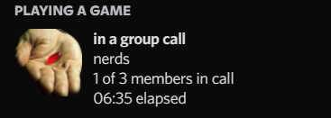
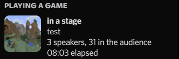

# AutoVoicePresence
AutoVoicePresence automatically sets a [rich presence](https://discord.com/rich-presence) when your Discord client does something voice-related. The rich presence is displayed on your Discord profile, which is visible for all other users to see. Your Discord activity is also updated to show your Discord voice status.

## Examples:
Voice Call

Group Call

Voice Channel

Stage Channel

## Support
Join the support server at https://discord.gg/2YAzK3Rpfj
